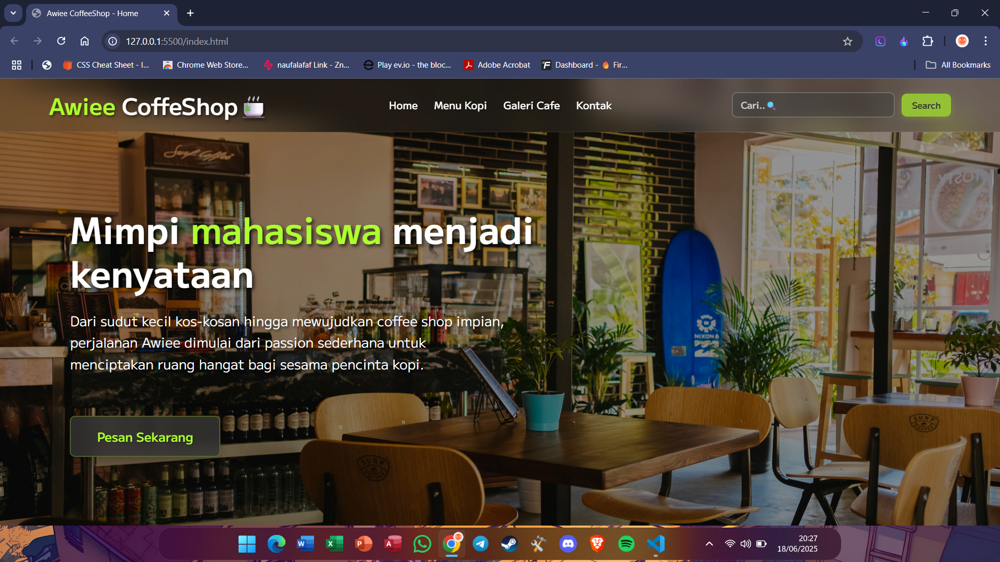

# ☕ Awiee CoffeeShop Web | Ujian Akhir Semester - Pengenalan Pemrograman

---

## 🙏 Sambutan

Dengan penuh hormat, Catatan ini dipersembahkan kepada:

**Bapak Reza Syafrizal, M.Kom**
Dosen Pengampu Mata Kuliah **Pengenalan Pemrograman**
Kelas: Informatika A - Semester 2

Sebagai bagian dari ujian akhir semester, saya, **Naufal Afaf Ekayana (NIM: 241730032)**, dengan bangga mempersembahkan hasil karya web sederhana bertemakan kedai kopi digital: **Awiee CoffeeShop**.

---

## 🌐 Deskripsi Singkat

**Awiee CoffeeShop** adalah website landing page bergaya modern yang dirancang untuk menampilkan tampilan profesional dari sebuah coffee shop.

---

## 📁 Struktur Proyek

---

## 🔗 Live Preview

> Klik tautan berikut untuk melihat langsung website-nya:
🌍 [Lihat Website Awiee CoffeeShop](https://mbullcodehex.github.io/uas/)

---

## 💻 Teknologi yang Digunakan

- **HTML5**
- **CSS3 (Modern Styling & Animations)**
- **Responsive Web Design (Media Queries)**

---

## 🧑‍🎓 Informasi Mahasiswa

| Keterangan | Detail |
|-----------|--------|
| Nama      | Naufal Afaf Ekayana |
| NIM       | 241730032 |
| Mata Kuliah | Pengenalan Pemrograman |
| Semester  | 2 |
| Kelas     | Informatika A |

---

## 📜 Lisensi

Proyek ini dibuat untuk kepentingan edukasi sebagai bagian dari Ujian Akhir Semester dan tidak untuk tujuan komersial.

---

**Terima kasih atas bimbingan dan ilmunya selama satu semester penuh 🙏**
_— Naufal_
